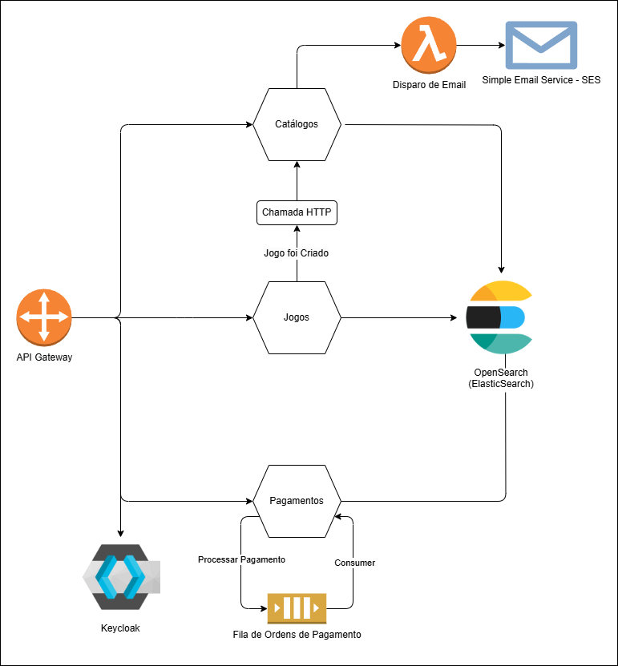

# FCG IaC Terraform

Este repositório contém a infraestrutura como código (IaC) para provisionamento de recursos AWS utilizando Terraform, incluindo OpenSearch, IAM, ECR, S3 e CodeBuild.

## Arquitetura
Esta arquitetura utiliza um **API Gateway** para integrar os microsserviços de **Jogos**, **Catálogos** e **Pagamentos**, além do **Keycloak** para autenticação. Cada microsserviço acessa seu próprio índice no **OpenSearch**. O microsserviço de Catálogos dispara uma função **Lambda** que usa **SES** para envio de e-mails. O microsserviço de Pagamentos processa ordens de forma assíncrona via mensageria.


O diagrama abaixo ilustra a arquitetura descrita:




### Repositórios dos Microsserviços

- **Jogos:** [fcg-games-microservice](https://github.com/PauloBusch/fcg-games-microservice)
- **Pagamentos:** [fcg-payment-service](https://github.com/M4theusVieir4/fcg-payment-service)
- **Catálogos:** [tech-challenge-net-phase-3](https://github.com/marceloalvees/tech-challenge-net-phase-3)


## Pré-requisitos

- [Terraform](https://www.terraform.io/downloads.html) instalado
- Credenciais AWS configuradas (via AWS CLI ou variáveis de ambiente)

## Como usar

1. Inicialize o Terraform:
   ```powershell
   terraform init
   ```
2. Visualize o plano de execução:
   ```powershell
   terraform plan
   ```
3. Aplique as mudanças:
   ```powershell
   terraform apply
   ```
4. **Para destruir toda a infraestrutura criada:**
   ```powershell
   terraform destroy
   ```

## Estrutura dos Arquivos

- [`main.tf`](main.tf): Configuração do provider AWS.
- [`variables.tf`](variables.tf): Definição de variáveis globais do projeto.
- [`configuration.tf`](configuration.tf): Configuração dinâmica dos microsserviços (dados de SQS, IAM, ECR, ECS, etc.).
- [`network.tf`](network.tf): Provisionamento de VPC, subnets públicas/privadas, Internet Gateway, Route Tables, Security Groups, Load Balancer (ALB) e API Gateway.
- [`iam.tf`](iam.tf): Recursos relacionados a usuários, grupos e permissões IAM, incluindo usuários para OpenSearch e SQS, e roles para CodeBuild/ECS.
- [`opensearch.tf`](opensearch.tf): Provisionamento do domínio OpenSearch e permissões de acesso.
- [`ecr.tf`](ecr.tf): Provisionamento dos repositórios ECR para imagens dos microsserviços.
- [`s3.tf`](s3.tf): Provisionamento dos buckets S3 para artefatos do CodeBuild.
- [`codebuild.tf`](codebuild.tf): Provisionamento dos projetos CodeBuild, configurados para build/deploy dos microsserviços.
- [`ecs.tf`](ecs.tf): Provisionamento do cluster ECS, definições de tasks e serviços Fargate para os microsserviços.
- [`sqs.tf`](sqs.tf): Provisionamento das filas SQS para mensageria dos microsserviços.
- `terraform.tfstate`, `terraform.tfstate.backup`: Arquivos de estado do Terraform.

## Variáveis principais

As variáveis principais estão definidas em [`variables.tf`](variables.tf):

- `aws_region`: Região AWS (padrão: us-east-2)
- `opensearch_domain`: Nome do domínio OpenSearch
- `ecs_cluster_name`: Nome do cluster ECS
- `ecs_enable_remote_cmd`: Habilita execução remota no ECS
- `ecs_task_cpu`: CPU alocada para tasks ECS (ex: 1024)
- `ecs_task_memory`: Memória alocada para tasks ECS (ex: 2048)
- `grafana_admin_password`: Senha do admin do Grafana


## Configuração dos Microsserviços

As configurações dinâmicas dos microsserviços estão definidas em [`configuration.tf`](configuration.tf):

- `microservices_config`: Lista de objetos contendo dados de OpenSearch, GitHub, ECR, S3, ECS, etc. para cada microsserviço. Cada campo é utilizado para provisionar recursos específicos via Terraform.
   - Exemplo:
      ```hcl
      microservices_config = [
         {
            key                  = "catalogs"
            opensearch_user      = "fcg-catalogs-opensearch-user"
            github_user          = "marceloalvees"
            github_repository    = "tech-challenge-net-phase-3"
            fcg_ci_project_name  = "fcg-catalogs-ci"
            ecr_repository_name  = "fcg-ecr-catalogs-repository"
            ecs_container_name   = "fcg-ecs-catalogs-container"
            s3_bucket_name       = "fcg-s3-catalogs-bucket"
            ecs_container_port   = 8082
         }
      ]
      ```

- `microservices_sqs_config`: Lista de objetos contendo dados de usuário e fila SQS para cada microsserviço. Usada para provisionar filas e usuários IAM específicos.
   - Exemplo:
      ```hcl
      microservices_sqs_config = [
         {
            key            = "payments"
            sqs_user       = "fcg-payments-sqs-user"
            sqs_queue_name = "fcg-payments-queue.fifo"
         }
      ]
      ```


## Observações

- As variáveis de configuração dos microsserviços controlam a criação dinâmica dos recursos AWS (ECR, ECS, SQS, IAM, S3, CodeBuild, etc.).
- O bucket S3 é utilizado para armazenar artefatos gerados pelo CodeBuild.
- As permissões necessárias para o CodeBuild acessar o bucket S3 são configuradas em `iam.tf`.
- Para adicionar um novo microsserviço, basta incluir um novo objeto nas variáveis de configuração em `configuration.tf`.
- Ajuste as variáveis conforme necessário para seu ambiente.

---

Atualize este README conforme o projeto evoluir.