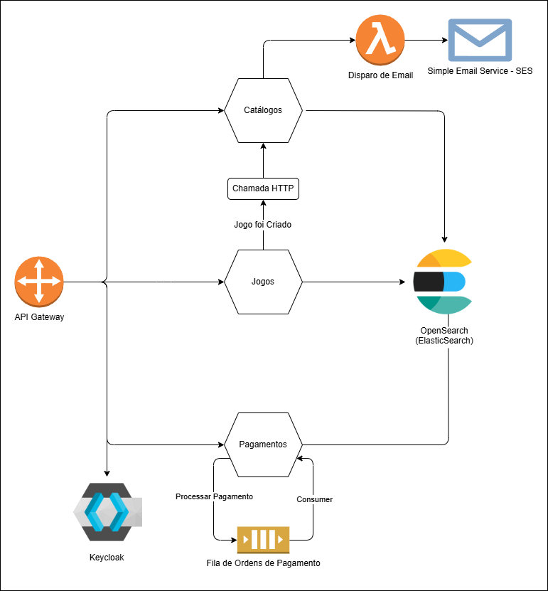

# FCG IaC Terraform

Este repositório contém a infraestrutura como código (IaC) para provisionamento de recursos AWS utilizando Terraform, incluindo OpenSearch, IAM, ECR, S3 e CodeBuild.

## Arquitetura
Esta arquitetura utiliza um **API Gateway** para integrar os microsserviços de **Jogos**, **Catálogos** e **Pagamentos**, além do **Keycloak** para autenticação. Cada microsserviço acessa seu próprio índice no **OpenSearch**. O microsserviço de Catálogos dispara uma função **Lambda** que usa **SES** para envio de e-mails. O microsserviço de Pagamentos processa ordens de forma assíncrona via mensageria.


O diagrama abaixo ilustra a arquitetura descrita:



### Repositórios dos Microsserviços

- **Jogos:** [fcg-games-microservice](https://github.com/PauloBusch/fcg-games-microservice)
- **Pagamentos:** [fcg-payment-service](https://github.com/M4theusVieir4/fcg-payment-service)
- **Catálogos:** [tech-challenge-net-phase-3](https://github.com/marceloalvees/tech-challenge-net-phase-3)

## Pré-requisitos

- [Terraform](https://www.terraform.io/downloads.html) instalado
- Credenciais AWS configuradas (via AWS CLI ou variáveis de ambiente)

## Como usar

1. Inicialize o Terraform:
   ```powershell
   terraform init
   ```
2. Visualize o plano de execução:
   ```powershell
   terraform plan
   ```
3. Aplique as mudanças:
   ```powershell
   terraform apply
   ```
4. **Para destruir toda a infraestrutura criada:**
   ```powershell
   terraform destroy
   ```


## Estrutura dos Arquivos

- [`main.tf`](main.tf): Configuração do provider AWS.
- [`variables.tf`](variables.tf): Definição de variáveis utilizadas no projeto.
- [`iam.tf`](iam.tf): Recursos relacionados a usuários, grupos e permissões IAM, incluindo permissões para CodeBuild acessar o bucket S3.
- [`opensearch.tf`](opensearch.tf): Provisionamento do domínio OpenSearch e permissões de acesso.
- [`ecr.tf`](ecr.tf): Provisionamento do repositório ECR.
- [`s3.tf`](s3.tf): Provisionamento do bucket S3 para armazenar artefatos do CodeBuild.
- [`codebuild.tf`](codebuild.tf): Provisionamento do projeto CodeBuild, configurado para salvar artefatos no bucket S3.
- `terraform.tfstate`, `terraform.tfstate.backup`: Arquivos de estado do Terraform.

## Variáveis principais

As variáveis principais estão definidas em [`variables.tf`](variables.tf):

- `aws_region`: Região AWS (padrão: us-east-2)
- `users`: Lista de usuários IAM para OpenSearch
- `opensearch_domain`: Nome do domínio OpenSearch
- `opensearch_user_group_name`: Nome do grupo de usuários OpenSearch
- `github_user` e `github_repo`: Informações do repositório GitHub
- `fcg_ci_project_name`: Nome do projeto CodeBuild

## Observações

- Certifique-se de que os usuários definidos em `users` existam ou serão criados corretamente.
- O bucket S3 é utilizado para armazenar artefatos gerados pelo CodeBuild.
- As permissões necessárias para o CodeBuild acessar o bucket S3 são configuradas em `iam.tf`.
- Ajuste as variáveis conforme necessário para seu ambiente.

---

Atualize este README conforme o projeto evoluir.